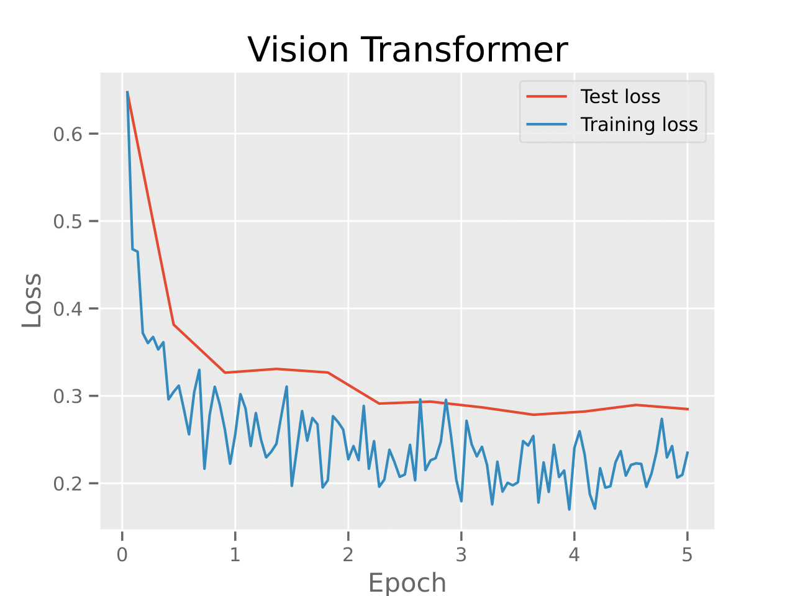
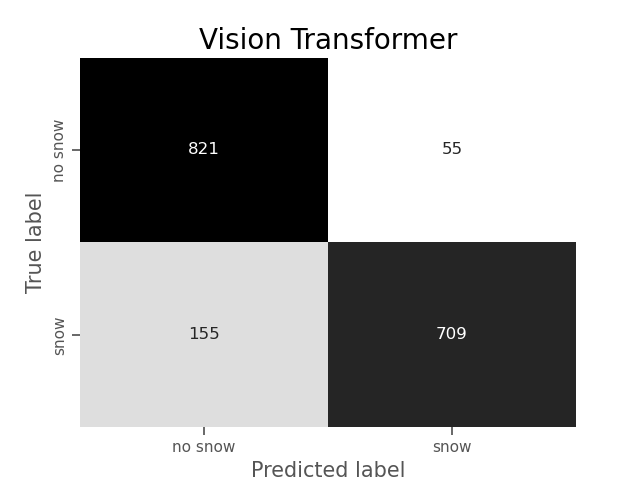
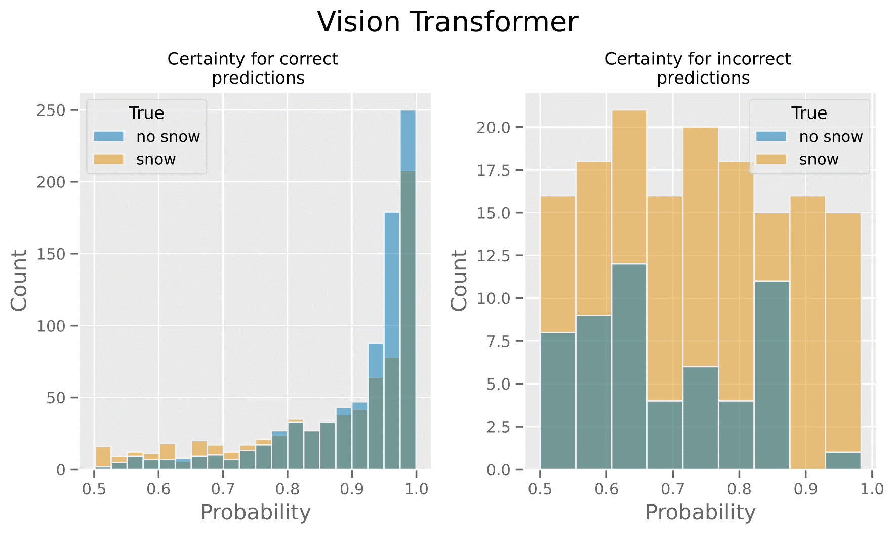

# Master's Thesis Results

This thesis explores machine learning methods for classifying road conditions based on CCTV-images.  

This README-file displays some results from implementing different models in my master's thesis. For more details see the full report available on the repository. The methodology is divided into two parts: the conventional method and the deep learning method. This README shows some results from each method for classifying snowy vs. non-snowy conditions.  

# Conventional Method

In this method a U-net was trained for segmenting roads from images and then extracting relevant features from the extracted roads. The U-net was trained on ca. 260 images of roads annotated by me. The methods used for extracting features include grey level run-length matrices and persistent homology. The image data used comprised ca. 1600 images annotated by me.  

First shown is the evolution of training and test loss during training of the U-net. An example of a segmented road is also shown.

The datasets extracted from the road comprised one using grey level run-length matrices and two using persistent homology. These were evaluated using four different classifiers: a fully connected neural network, a support vector machine, a naive Bayes, and a random forest. The table below shows the mean accuracies and standard deviation achieved for all combinations of classifier and dataset.

| Classifier    | GLRLM            | PD basic          | Persistent images   |
|---------------|------------------|-------------------|---------------------|
| FCN           | 76.1% ± 5.7      | 76.3% ± 4.9       | 73.4% ± 3.7         |
| SVM           | 77.6% ± 3.7      | 76.3% ± 3.4       | 67.5% ± 3.2         |
| Naive Bayes   | 52.7% ± 9.6      | 49.1% ± 7.6       | 58.7% ± 7.2         |
| Random Forest | 61.6% ± 5.9      | 66.3% ± 4.7       | 71.4% ± 1.9         |

# Deep Learning Method

This method consisted of fine-tuning a convolutional neural network and a vision transformer. The vision transformer was fine-tuned using ca. 9000 images annotated by me. This section only presents results from fine-tuning the vision transformer. First is shown the evolution of the training and test loss during fine-tuning along with the resulting confusion matrix. The achieved accuracy was 87.9%.  

 
In a real-world implementation, reporting classifications with an associated probability above a certain threshold is only relevant. To determine a good threshold it is of interest to look at the distributions of the predicted probabilities when the model is correct and incorrect. The following image shows these distributions with correct predictions to the right and incorrect predictions to the left. We can determine that a threshold of 80% could be suitable in this case since most correct predictions will be reported and most incorrect predictions will be disregarded.

